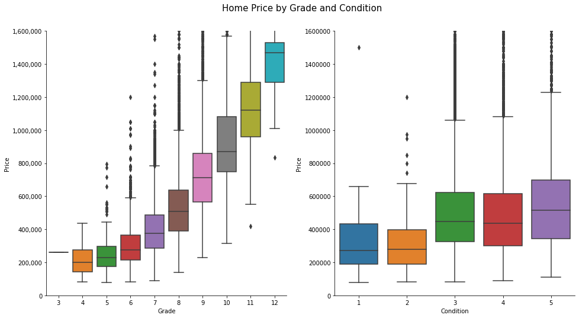

# Phase 2 Project

Author: Magali Solimano
Date: July 28, 2022

## Project Overview

The Phase 2 Project applies linear regression modeling to analyze house sales in King County, Washington.

## Business Problem

King County, Washington, which has been one of the fastest growing counties in the US since the 1970s and is more recently experiencing outward migration, has an active residential real estate market.

Goal: The county has commissioned analysis of its house sales to assist home buyers and sellers to make informed decision-making in the single-family residential real estate market. Homeowners and prospective buyers and sellers can use this analysis to assess feature improvements and their impact on home prices. This analysis serves as a baseline for deeper dives on the county’s residential real estate market.

## The Data

The project uses the King County House Sales dataset, which can be found in  `kc_house_data.csv` in the data folder in this repo. The description of the column names can be found in the repo's Jupyter Notebook, as well as in `column_names.md` in the same folder. The dataset has more than 21,000 records, with continuous data variables and categorical variables.

## Methods
The analysis utilizes descriptive data analysis and descriptive statistics, in addition to linear regression modeling.

## Results
Interpretative linear regression modeling explains 71% of the variation in single-family house prices. Key model inputs include: square footage, construction grade, condition, number of bathrooms, location (as determined by city), waterfront, renovated. Surprisingly, the number of bedrooms is not statistically significant in the model.

## Next Steps
Further analysis should seek to improve model performance. Extended analysis could examine one or all of the following: age of house and age of renovations; number of bedrooms to bathrooms; geolocation maps; application of log transformation on select variables such as price and square footage, which was explored but not part of the final model for ease of interpretability.

## More Information
See the full analysis in the [Jupyter Notebook](https://github.com/magalisolimano/dsc_phase2_project/blob/main/phase2project_magalisolimano.ipynb) or review the [presentation](https://github.com/magalisolimano/dsc_phase2_project/blob/main/presentation_phase2.pdf). For additional information, contact Magali Solimano at magali.solimano@gmail.com.
